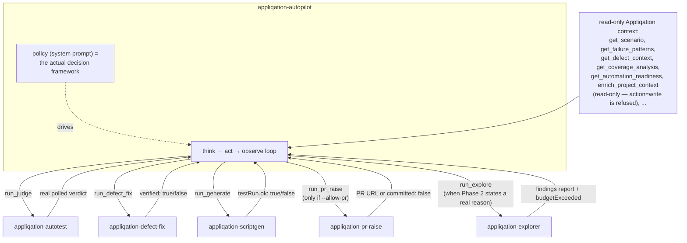
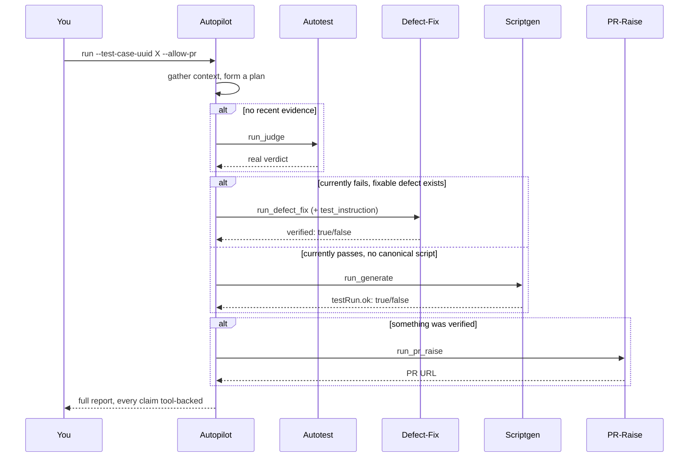
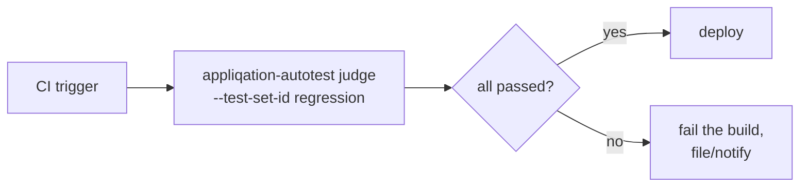
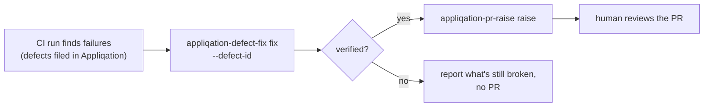
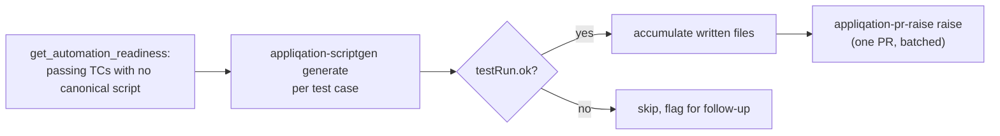

# Appliqation Autopilot

**An agentic orchestrator that decides — for real, every time — whether a test case needs
autonomous testing, a defect fix, new automation, or a pull request, instead of running a
fixed script.**

Most "AI test automation" tooling is a pipeline with an LLM bolted onto one step. Autopilot
is different: given one test case, it gathers real signal (current pass/fail state,
flakiness, linked defects, coverage priority, whether automation already exists), reasons
about what's actually warranted the way a senior QA engineer scoping their day would, states
a plan, and executes it — checking real results after every action and adapting when reality
disagrees with the plan, rather than committing blindly upfront.

It orchestrates five independent, single-purpose agents as ordinary tools it can call. None
of them know Autopilot exists. Each does one thing well and can be scripted directly if you
want deterministic control instead. Autopilot is the layer above them that decides *when* and
*whether* to use each one.

## Introducing the agents

| Agent | Does | Repo |
|---|---|---|
| **Autotest** | Runs a test case in a real browser; a second, independent AI judges the result from evidence alone — never its own claim. | [`appliqation-autotest`](https://github.com/appliqation/appliqation-autotest) |
| **Defect-Fix** | Loads full defect context, locates and applies a real code fix, syncs the scenario, verifies with a real Playwright run. | [`appliqation-defect-fix`](https://github.com/appliqation/appliqation-defect-fix) |
| **Scriptgen** | Drafts a Playwright script for an untested-but-passing test case, iterating against real runs until genuinely green. | [`appliqation-scriptgen`](https://github.com/appliqation/appliqation-scriptgen) |
| **PR-Raise** | Fully mechanical, no LLM: commits whatever's already changed, pushes, opens or reuses a pull request. | [`appliqation-pr-raise`](https://github.com/appliqation/appliqation-pr-raise) |
| **Explorer** | Open-ended exploratory QA — a senior-QA heuristics pass plus security/network/caching/mobile probes, headlessly, the coverage a scripted test case never checks for. | [`appliqation-explorer`](https://github.com/appliqation/appliqation-explorer) |

All five share [`@appliqation/agent-core`](https://github.com/appliqation/appliqation-agent-core), the generic think→act→observe engine, budget tracking, and tool-dispatch machinery underneath each of them.

## Why this is different from "wire an LLM to some CLIs"

- **The reasoning is real, not decorative.** The system prompt (`src/policy/systemPrompt.ts`)
  encodes an actual decision framework — not "call these tools in order," but genuine
  branches: a currently-*failing* test case does **not** get a script generated for it (that
  would encode broken behaviour as a false baseline); a flaky one gets a script but with
  explicitly lowered confidence in the report; a low-priority one may legitimately get *no*
  action at all, just a recommendation. Taking no action is a valid outcome, not a failure to
  route.
- **It never fabricates an outcome.** Every claim in the final report has to trace back to a
  real tool result. `run_generate`'s `testRun.ok` and `run_defect_fix`'s `verified` reflect an
  actually-executed Playwright run, not the model's own claim about it. `run_judge`'s status is
  polled from Appliqation's own authoritative run record, not parsed out of report prose. If
  Autopilot says a test passes, it's because it watched that happen.
- **The reasoning lives here, in the open — not behind a private API.** The five sibling
  agents are genuinely self-contained; the *judgment* about how to combine them is this
  repo's own code, fully readable, forkable, and swappable (see
  [Customizing the policy](#customizing-the-policy)). Nothing about how this agent thinks is
  hidden behind a server only Appliqation can change. One concrete example:
  `appliqation-defect-fix` has no way to know, on its own, how much testing a given fix
  actually needs verified — that call is genuinely Autopilot's to make, from the broader
  signal (defect history, run context) it's already gathering, and it's required to state
  that reasoning explicitly rather than pass the sibling agent a generic instruction.
- **Raising a pull request is opt-in, not assumed.** `run_pr_raise` isn't even in the tool
  list Autopilot's model sees unless you pass `--allow-pr`. Without it, Autopilot still
  reasons about whether a PR would be warranted — it just tells you so instead of doing it.

## The complete agentic system



- **Context tools** are ordinary read-only Appliqation MCP tools — the same signal a human QA lead would look at before deciding where to spend effort. This includes the project's own living context document (`enrich_project_context`, action=read) — known issues, high-risk areas, regression watchlist, pain points, personas — so a TC in a known-risky area gets weighed differently than the same raw evidence somewhere unremarkable. The tool also has a write mode; autopilot can only ever read it — see [Safety](#safety).
- **Action tools** each spawn the corresponding sibling agent's CLI as a real subprocess with `--json`, and hand the model back the exact, real structured result — never a summary of one.
- **The policy** (`src/policy/systemPrompt.ts`) is the one piece of genuine "brain" — a detailed, phase-based methodology for gathering context, forming a plan, executing it adaptively, and reporting honestly. It's a plain string. Read it, fork it, replace it.

## Workflow options

Autopilot's judgment is one way to use this family — not the only one. Here are four real shapes, from fully autonomous to fully scripted.

### 1. Full autonomous mode

Point Autopilot at a test case and let it decide everything: gather context, judge current state, fix or generate as warranted, raise the PR.



```bash
npx appliqation-autopilot run --test-case-uuid <uuid> --environment Stage --repo-path <path> --allow-pr
```

### 2. Deterministic CI pipeline (no orchestrator)

Skip Autopilot entirely and script the individual agents directly — full control, zero LLM judgment about *what* to run, still LLM-verified per step.



```bash
npx appliqation-autotest judge --test-set-id <id> --environment Stage --ci
```

### 3. Defect triage & auto-fix

A regression run surfaces failures and defects get filed. Route each one through Defect-Fix (directly, or via Autopilot for scope judgment), open a PR, let a human review.



```bash
npx appliqation-defect-fix fix --defect-id <id> --repo-path <path> --dry-run   # first pass, safe
npx appliqation-defect-fix fix --defect-id <id> --repo-path <path>            # once trusted
```

### 4. Coverage backfill

Systematically pay down test-automation debt: find passing-but-unautomated test cases, generate and verify canonical scripts for each, batch them into a PR.



```bash
npx appliqation-scriptgen generate --test-case-uuid <uuid> --repo-path <path> --ci
```

## Quick start

```bash
git clone https://github.com/appliqation/appliqation-autopilot.git
cd appliqation-autopilot
npm install
cp .env.example .env   # fill in APPQ_API_KEY and one LLM provider key
npm run build
```

You'll also need the five sibling agents reachable — either installed globally once
they're published (`npm install -g appliqation-autotest appliqation-defect-fix
appliqation-scriptgen appliqation-pr-raise appliqation-explorer`), or point at local builds
via `AUTOTEST_CMD` / `DEFECT_FIX_CMD` / `SCRIPTGEN_CMD` / `PR_RAISE_CMD` / `EXPLORER_CMD` in
`.env` (see `.env.example`).

```bash
npx appliqation-autopilot run \
  --test-case-uuid <uuid> \
  --environment Stage \
  --repo-path /path/to/your/checkout
```

Watch stderr — every context tool call, every action, and the model's own reasoning
(`[thinking]` lines) stream live. Add `--allow-pr` once you're ready to let it actually open
pull requests; add `--json`/`--ci` for a single structured result and a CI-friendly exit code
instead of the human-readable transcript.

## Customizing the policy

The default policy in `src/policy/systemPrompt.ts` is opinionated: don't automate a currently
failing test, flag flaky results as lower-confidence, treat "no action needed" as a legitimate
outcome. Your organization might weigh these differently — more conservative, a different
priority order, a different report format for your own stakeholders.

You don't need to touch anything else in this repo to change that:

```bash
npx appliqation-autopilot run --policy ./my-policy.md ...
# or set POLICY_FILE in .env
```

Anything you put in that file becomes the system prompt driving every decision. The
orchestration code (`src/orchestrator/`, `src/tools/`) doesn't change — it just runs whatever
policy it's given against the same tools.

If what you actually want is full deterministic control with no LLM judgment in the loop at
all, you don't need Autopilot for that — script `appliqation-autotest`,
`appliqation-defect-fix`, `appliqation-scriptgen`, and `appliqation-pr-raise` directly; each
is a complete, independently useful CLI (see [workflow 2](#2-deterministic-ci-pipeline-no-orchestrator)).

## Safety

- `run_pr_raise` is excluded from the tool list entirely unless `--allow-pr` is passed —
  a hardcoded exclusion, not a soft warning the model could talk itself past.
- Every meta-tool result is the sibling agent's own real `--json` output — including on
  failure (a failed/blocked `run_judge`, an unverified `run_generate`/`run_defect_fix`), so a
  bad outcome is visible to the model as data to reason about, never swallowed.
- The individual agents carry their own safety invariants independently — a destructive-action
  gate on any browser interaction, an allowlisted shell surface for `appliqation-scriptgen`'s
  and `appliqation-defect-fix`'s environment bootstrap, `appliqation-defect-fix`'s own appq
  writes gated behind its own `--dry-run` (which Autopilot can pass through via
  `run_defect_fix`'s `dry_run` argument), no credentials ever flowing through an LLM's own
  context. Autopilot doesn't weaken any of that; it just decides when to invoke it.
- No credentials of any kind pass through the LLM's context at any point in this repo.
- `enrich_project_context` is a single Appliqation tool with both `action=read` and
  `action=write` modes — tool-*name* allowlisting alone can't express "this tool, but
  only this argument value," so `@appliqation/agent-core`'s `createReadOnlyProjectContextDispatcher`
  adds an argument-level gate on top: only `action=read` is ever let through, and the
  check fails closed (a missing or malformed `action` is refused too, not just an
  explicit `"write"`). Shared with `appliqation-explorer`, which needs the identical
  guarantee.
- `appliqation-explorer` is read-only end to end — including on the project context
  document its own upstream workflow (`appq:runman`) would otherwise write to. When that
  workflow runs interactively in Claude Code, a human is present at its confirmation gate
  before anything gets persisted as fact for future passes; a headless `run_explore` call
  has no equivalent, so it holds the same conservative default as Autopilot itself rather
  than the permissive one baked into the interactive prompt. See that repo's README for
  the full reasoning.

## Configuration

See `.env.example` for the full list. In short: `APPQ_API_KEY` + one LLM provider key are
required; `AUTOTEST_CMD`/`DEFECT_FIX_CMD`/`SCRIPTGEN_CMD`/`PR_RAISE_CMD`/`EXPLORER_CMD` tell
Autopilot how to reach the sibling agents; `BUDGET_MAX_*` caps the tool-calling loop;
`POLICY_FILE` points at a custom policy.

Optionally, `AUDIT_MONGO_URI`/`AUDIT_MONGO_DB`/`AUDIT_MONGO_COLLECTION` or
`AUDIT_JSONL_PATH` records one audit entry per invocation (token usage, duration, real
outcome) to a datastore this agent family owns — deliberately not part of Appliqation
itself, since this is a parallel system that uses it, not a feature of it. Every sibling
agent in the family writes to the same shape; [`appliqation-dashboard`](https://github.com/appliqation/appliqation-dashboard)
reads it back as an aggregated report. Entirely opt-in — nothing is recorded unless one
of these is set, and a write failure never affects a real run's outcome.

## Development

```bash
npm run dev -- run --test-case-uuid <uuid> --environment <name> --repo-path <path>
npm run typecheck
npm test
```

See `CLAUDE.md` for a map of this repo if you're working in it with an AI coding assistant.

## License

MIT — see [LICENSE](./LICENSE).
